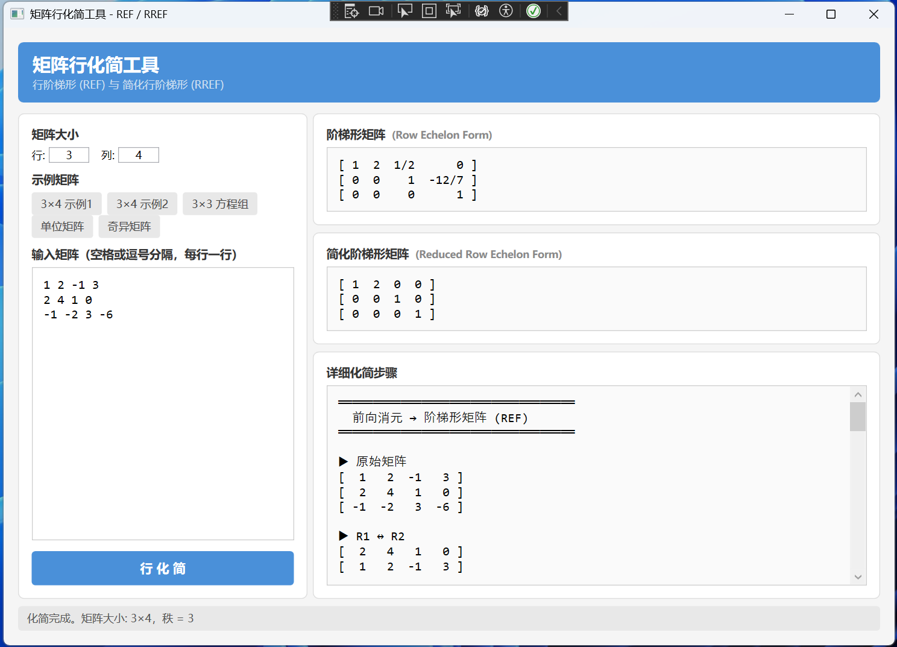

# MatrixReducer

一个基于 WPF 的矩阵行化简工具，可将输入矩阵通过初等行变换化简为**阶梯形矩阵 (REF)** 和**简化阶梯形矩阵 (RREF)**，并展示每一步的详细过程。

## 截图



## 功能

- 输入任意大小的矩阵（1×1 ~ 10×10）
- 计算阶梯形矩阵（Row Echelon Form）
- 计算简化阶梯形矩阵（Reduced Row Echelon Form）
- 显示逐步化简过程（行交换、行倍乘、行加减）
- 自动计算矩阵的秩（Rank）
- 精确分数运算，无浮点误差
- 内置多个示例矩阵

## 环境要求

- .NET 8.0 SDK
- Windows（WPF 应用）

## 运行

```bash
dotnet run --project src/MatrixReducer
```

## 输入格式

在文本框中输入矩阵，每行一行数据，元素之间用空格、逗号或制表符分隔。

支持以下数值格式：

| 格式 | 示例 |
|------|------|
| 整数 | `3`, `-7` |
| 分数 | `1/3`, `-5/7` |
| 小数 | `0.5`, `-2.25` |

示例输入：

```
1 2 -1 3
2 4 1 0
-1 -2 3 -6
```

## 项目结构

```
MatrixReducer/
├── MatrixReducer.slnx                      # 解决方案文件
├── src/
│   └── MatrixReducer/
│       ├── MatrixReducer.csproj            # WPF 项目文件
│       ├── Fraction.cs                     # 分数类型，精确有理数运算
│       ├── MatrixOperations.cs             # 行化简算法（REF / RREF）
│       ├── MainViewModel.cs                # ViewModel，数据绑定与业务逻辑
│       ├── MainWindow.xaml                 # UI 布局
│       └── MainWindow.xaml.cs              # 事件处理
└── tests/
    └── MatrixReducer.Tests/
        ├── MatrixReducer.Tests.csproj      # 测试项目文件
        ├── FractionTests.cs                # Fraction 单元测试
        └── MatrixOperationsTests.cs        # 行化简算法单元测试
```

## 算法说明

### 前向消元（→ REF）

1. 从左到右逐列寻找主元（pivot），选取绝对值最大的行作为主元行（部分主元选取）
2. 交换行，使主元移至当前行
3. 将主元所在行除以主元值，使主元归一化为 1
4. 用主元行消去下方所有行对应列的元素

### 回代消元（→ RREF）

在 REF 的基础上，从最后一个主元列开始向上消元，使每个主元列中除主元外的元素全部为 0。
